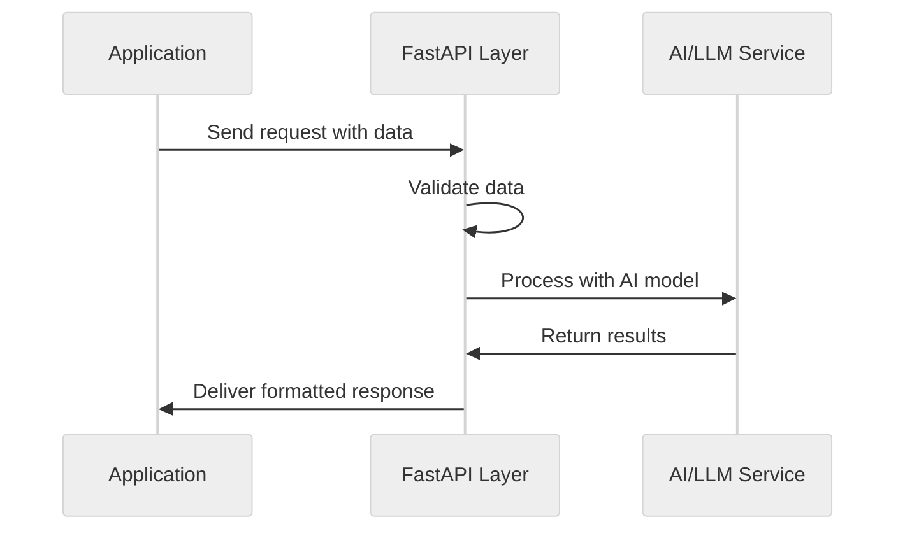

# FastAPI for AI Applications

## What is FastAPI?

[FastAPI](https://fastapi.tiangolo.com/) is a modern, high-performance web framework for building APIs with Python. For AI apps, it serves as the interface between your AI models and the outside world, allowing external systems to send data to your models and receive predictions or processing results. What makes FastAPI particularly appealing is its simplicity and elegance - it provides everything you need without unnecessary complexity.



### Why FastAPI for AI Engineering?

1. **Performance**: Built on Starlette and Pydantic, FastAPI is fast and just works.
2. **Automatic Documentation**: FastAPI automatically generates interactive API documentation (via Swagger UI and ReDoc) from your code and type annotations, making it easier for teams to collaborate.
3. **Type Safety**: Leveraging Pydantic, FastAPI provides automatic request validation and clear error messages, reducing the likelihood of runtime errors.
4. **Asynchronous Support**: Native support for async/await patterns allows your API to handle multiple requests efficiently while waiting for AI model responses.
5. **WebSocket Support**: For streaming AI responses or building real-time applications, FastAPI provides first-class WebSocket support.

## Learn More

Beyond this README, [this tutorial](https://fastapi.tiangolo.com/tutorial/) shows you how to use FastAPI with most of its features, step by step. 

## Quick Start

1.  **Install dependencies**:
    ```bash
    uv sync
    ```

2.  **Run the application**:
    Run the following command from the root of the repository:
    ```bash
    uv run uvicorn main:app --app-dir 01-fundamentals/03-fastapi --reload
    ```

3.  **Access your API**:
    -   API endpoints: http://localhost:8000/docs
    -   Interactive docs: http://localhost:8000/docs

### About Uvicorn

Uvicorn is an ASGI server that actually runs your FastAPI application. While FastAPI defines your API structure and logic, Uvicorn is the server that handles HTTP connections and serves your application. 

Think of FastAPI as the blueprint for your API, and Uvicorn as the engine that powers it.

The command `uvicorn main:app --app-dir 01-fundamentals/03-fastapi --reload` means:
-   `main`: Use the file named `main.py`
-   `:app`: Look for a variable named `app` within that file
-   `--app-dir 01-fundamentals/03-fastapi`: Tells Uvicorn where to look for the application file, allowing it to handle imports correctly from the root.
-   `--reload`: Automatically restart the server when you change your code (useful during development)

### Default Port

By default, Uvicorn runs on port 8000. This means:
-   Your API will be accessible at `http://localhost:8000`
-   `localhost` refers to your own computer
-   `8000` is the "door" or port number through which requests can access your API

You can change this with the `--port` flag if needed:
```bash
uvicorn main:app --app-dir 01-fundamentals/03-fastapi --port 5000
```

## Structure

We have organized the application into modular files:

-   `main.py`: Application entry point that creates the FastAPI app.
-   `router.py`: Routes incoming requests to the appropriate endpoint handlers.
-   `endpoint.py`: Contains the core logic for the AI integrations (OpenAI, LangChain).
-   `models.py`: Defines Pydantic data models for request validation.

This modular approach keeps your code organized as your AI application grows in complexity.

> For comprehensive documentation, visit the [FastAPI official docs](https://fastapi.tiangolo.com/).

## Code Walkthrough

Let's examine how our files work together to create a clean API for processing AI events.

### 1. `main.py` - Application Entry Point

```python
from fastapi import FastAPI
from router import router

app = FastAPI(
    title="AI API - Fundamentals",
    description="API demonstrando integração com OpenAI e LangChain"
)

app.include_router(router)
```

This file:
-   Creates the main `FastAPI` application instance.
-   Imports and includes our main `router`.
-   Serves as the entry point for Uvicorn.

### 2. `router.py` - Request Routing

```python
from fastapi import APIRouter
from endpoint import generate_text_openai
from models import GenerateRequest

router = APIRouter()

@router.post("/openai")
async def endpoint_openai(request: GenerateRequest):
    # Call the logic function
    result = await generate_text_openai(request.prompt)
    return {"response": result}
```

This file:
-   Creates an `APIRouter`.
-   Defines endpoints (e.g., `/openai`).
-   Connects the HTTP request to the logic in `endpoint.py`.

### 3. `endpoint.py` - Core Logic

```python
import os
from openai import AsyncOpenAI

async def generate_text_openai(prompt: str) -> str:
    """
    Integração direta com SDK da OpenAI (Async).
    """
    client = AsyncOpenAI(api_key=os.getenv("OPENAI_API_KEY"))
    # ... call API ...
    return response.choices[0].message.content
```

This file:
-   Contains the "business logic" or "AI logic".
-   Interacts directly with external services like OpenAI.
-   Keeps the router clean of implementation details.

### 4. `models.py` - Data Validation

```python
from pydantic import BaseModel
from typing import Optional

class GenerateRequest(BaseModel):
    prompt: str
    topic: Optional[str] = None
```

This file:
-   Defines the structure of expected data using Pydantic.
-   Ensures that requests have the necessary fields (like `prompt`).

## Sync vs. Async Endpoints in FastAPI

FastAPI supports both synchronous and asynchronous request handlers.

### Synchronous Endpoints

Synchronous endpoints use standard Python functions and block the server while processing:

```python
@router.post("/sync")
def sync_endpoint(data: EventSchema):
    # This blocks the server until completion
    result = process_data(data)
    return {"result": result}
```

**When to use:** For quick operations that complete rapidly (under 1 second)

### Asynchronous Endpoints

Asynchronous endpoints use Python's `async`/`await` syntax and don't block the server:

```python
@router.post("/async")
async def async_endpoint(data: EventSchema):
    # This doesn't block the server
    result = await async_process_data(data)
    return {"result": result}
```

**When to use:** For operations that:
-   Involve I/O operations (API calls, database queries)
-   Take longer to process (complex AI inference)
-   Need to handle many concurrent requests

**In our module:** We use `async` definitions because we are calling external APIs (OpenAI) which are I/O bound.

## Understanding API Methods: GET vs POST

If you're new to APIs, think of the difference between GET and POST as similar to the difference between reading and writing.

-   **GET (Asking for Information)**: Used to retrieve information without changing anything.
-   **POST (Sending Information)**: Used to send data that needs to be processed. In our case, we use **POST** to send a prompt to the AI model.

## Securing Your FastAPI Endpoint with Bearer Tokens

**Note:** The current implementation in this module is simplified and does not include authentication. However, security is critical for production AI APIs.

Bearer token authentication is the recommended approach for modern APIs.

### Implementing Bearer Token Authentication (Conceptual)

```python
from fastapi import Depends, HTTPException
from fastapi.security import HTTPBearer, HTTPAuthorizationCredentials

security = HTTPBearer()
API_TOKEN = "your-secret-token"

@router.post("/openai")
def handle_event(
    request: GenerateRequest,
    credentials: HTTPAuthorizationCredentials = Depends(security)
):
    if credentials.credentials != API_TOKEN:
        raise HTTPException(status_code=401, detail="Invalid token")
    # Proceed...
```

For production applications, generally consider using tokens to control access to your AI resources!
