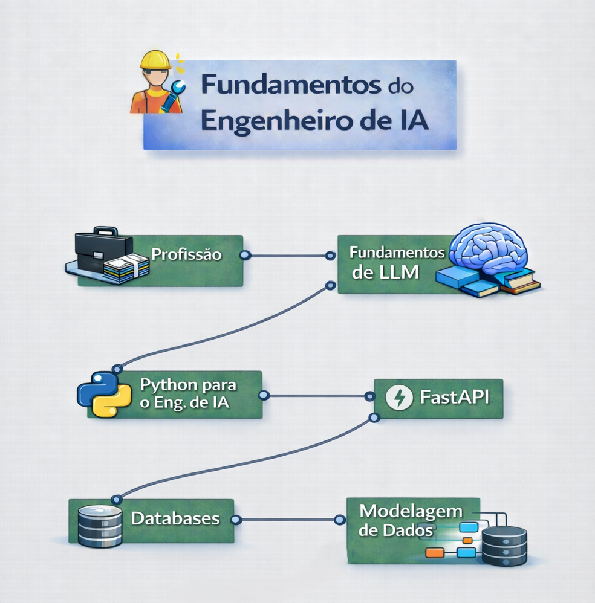

    

# **Bloco 1 — Fundamentos da Engenharia de IA**

### Base técnica para construção de sistemas de IA probabilísticos, assíncronos e orientados a produção

---

### Tecnologias e padrões utilizados ao longo do bloco

Python moderno • APIs assíncronas • validação estruturada • LLM orchestration • RAG pipelines • bancos relacionais e vetoriais

---
## 📚 Ementa do Módulo

### [Módulo 01: A Profissão de AI Engineer & Mercado](./01-ai-engineer-profession)
- **O Papel:** A diferença entre AI Engineer, ML Engineer e Backend Dev. Foco em **Produto** e **Sistemas**.
- **Os 3 Pilares:** Fluência em Foundation Models (Prompting, Structured Outputs), Arquitetura de Sistemas (RAG, Agentes) e Engenharia de Produção.
- **Mindset:** Construção de software robusto em cima de componentes não-determinísticos.

### [Módulo 02: Fundamentos de LLMs & GenAI](./02-llm-fundamentals)
- **A "Física" dos LLMs:** Tokens, Context Window, Temperature, Top-P e o conceito de *Autoregressive*.
- **Prompt Engineering:** Ciência, não arte. Zero-shot, Few-shot, Chain-of-Thought (CoT).
- **Agentes & Tools:** Tool Calling como a base para agentes autônomos que interagem com o mundo.
- **Estratégia:** Quando usar RAG vs Fine-tuning.

### [Módulo 03: Python Moderno para AI Engineers](./03-python-for-ai)
- **Stack de Engenharia:** Gerenciamento de dependências com `uv` e estrutura de monorepo.
- **Bibliotecas Core:** Pydantic, HTTPX, AsyncIO, Tenacity para resiliência.
- **Frameworks de IA:** Visão geral de LangChain, LangGraph, LlamaIndex e Agno.
- **Observabilidade:** A importância de logs estruturados e tracing em sistemas estocásticos.

### [Módulo 04: APIs & Backend com FastAPI](./04-fastapi)
- **Produção:** Construção de APIs assíncronas de alta performance para servir modelos e RAG.
- **Design:** Injeção de dependência, validação com Pydantic e OpenAPI (Swagger).
- **Integração:** Conectando OpenAI/LangChain via endpoints HTTP seguros e escaláveis.

### [Módulo 05: Modelagem e Contratos de Dados (Pydantic V2)](./05-data-modeling)
- **Contratos de Dados:** Schemas rigorosos como a "camada de confiabilidade" para outputs de LLM.
- **Features Avançadas:** Validadores customizados, Tipos Ricos (Enum, URL, UUID) e Unions Discriminadas.
- **Pipeline de Extração:** Implementando retries automáticos com feedback de erro estruturado.
- **Configuração:** Gerenciamento de variáveis de ambiente com `pydantic-settings`.

### [Módulo 06: Bancos de Dados (SQL + Vetorial)](./06-databases)
- **Vector Databases:** Conceitos de Embeddings, Busca Semântica vs Busca Exata e `Payload`.
- **Métricas:** Distância de Cosseno, Dot Product e indexação HNSW.
- **Qdrant:** Setup e uso prático (Local em memória vs Docker em produção) com filtragem de metadados.
- **Arquitetura Híbrida:** Quando integrar SQL (Postgres) com Vector DBs.
---

## 🚀 Como Começar
Acesse os módulos sequencialmente. O conhecimento é cumulativo.
Comece pelo **[Módulo 01: A Profissão de AI Engineer & Mercado](./01-ai-engineer-profession)**.
