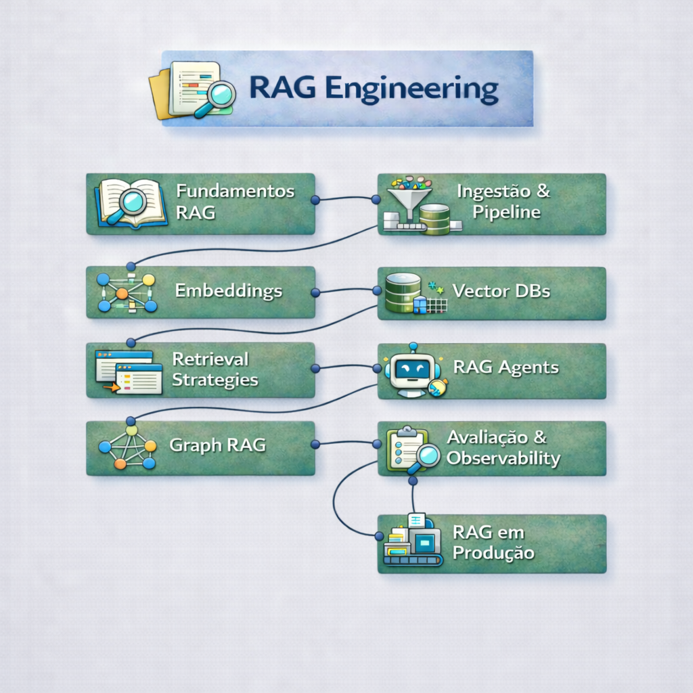

    

# 🔹 Bloco 2: Sistemas RAG (Retrieval-Augmented Generation)

> **Objetivo:** Conectar LLMs aos seus dados privados.  
> **Status:** A arquitetura mais comum em produção hoje.

---

### Tecnologias e padrões utilizados ao longo do bloco

Python moderno • APIs assíncronas • validação estruturada • LLM orchestration • RAG pipelines • bancos relacionais e vetoriais

## 📚 Ementa do Módulo

### [Módulo 1: Fundamentos de RAG e Modelos Mentais](./01-rag-fundamentals)
- **Definição:** RAG = Busca (Retrieval) + Geração (Generation).
- **Por que RAG?** Superando alucinações e data de corte (knowledge cutoff).
- **Arquitetura Padrão:** Ingestion -> Store -> Retrieve -> Generate.

### [Módulo 2: Ingestão de Dados e Pipelines](./02-ingestion-pipeline)
- **ETL para IA:** Extrair texto limpo de PDFs, HTML e Markdown.
- **Chunking:** Estratégias (Fixed-size, Recursive, Semantic) e seus impactos.
- **Metadados:** Por que metadados são mais importantes que o texto em si.

### [Módulo 3: Embeddings (Visão Moderna)](./03-embeddings)
- **Conceito:** Transformando texto em vetores numéricos.
- **Modelos:** OpenAI vs Open Source (bge-m3, e5).
- **Multilingual:** Lidando com português e inglês misturados.

### [Módulo 4: Vetor Databases (Vector DBs)](./04-vector-dbs)
- **Opções:** Qdrant (Rust/Performance) vs pgvector (Simplicidade/Postgres).
- **Indexação:** HNSW explicado para humanos.
- **Tradeoffs:** Memória vs Disco vs Velocidade.

### [Módulo 5: Estratégias de Retrieval (Crítico)](./05-retrievers)
- **Hybrid Search:** Misturando busca semântica (Vetores) com busca exata (BM25/Keywords).
- **Reranking:** O segredo para dobrar a precisão. (Cohere Rerank / Cross Encoders).
- **Query Expansion:** Melhorando a pergunta do usuário antes de buscar.

### [Módulo 6: RAG Agents](./06-rag-agent)
- **Frameworks:** LangChain vs LlamaIndex.
- **Implementação:** Agentes que raciocinam sobre os dados.
- **Tool Use:** Capacitando o LLM a buscar informações sob demanda.

### [Módulo 7: Graph RAG](./07-graph-rag)
- **Knowledge Graphs:** Estruturando dados complexos.
- **Relações:** Indo além da busca vetorial simples.
- **Implementação:** Construindo um Graph RAG do zero.

### [Módulo 8: Avaliação e Observabilidade](./08-evaluation)
- **Ragas:** Framework de avaliação automática (Faithfulness, Answer Relevancy).
- **Tracing:** Visualizando cada passo com Langsmith/Langfuse.
- **Golden Datasets:** Criando um conjunto de testes confiável.

### [Módulo 09: RAG em Produção](./09-rag-production)
- **Otimização:** Cache Semântico, Streaming, Latência.
- **Segurança:** Prompt Injection em RAG.
- **Custos:** Estimando tokens de input/output em escala.

---

## 🚀 Como começar
Vá para **[Módulo 1: Fundamentos de RAG](./01-rag-fundamentals)**.
