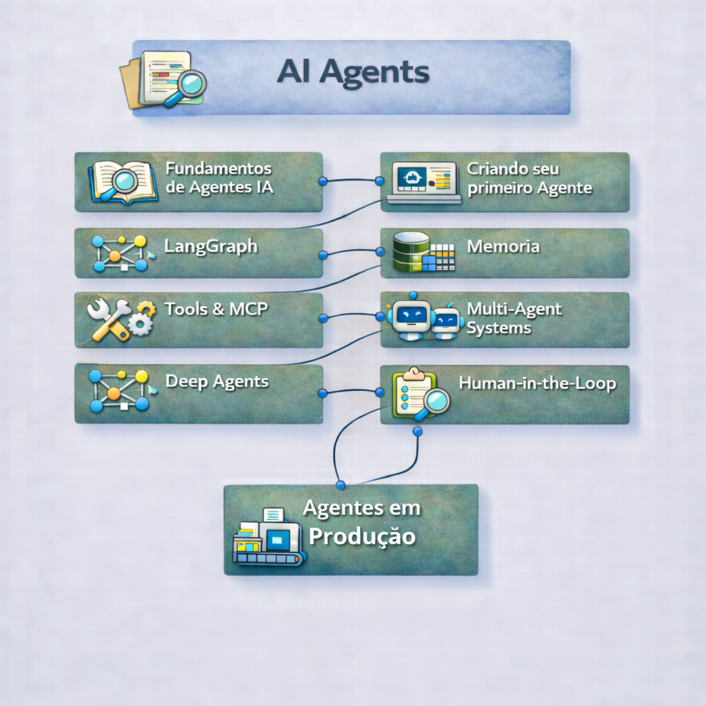

    

# 🔹 Bloco 3: Agentes de IA & Sistemas Inteligentes

> **Objetivo:** Projetar sistemas que raciocinam, decidem e agem.  
> **Status:** A fronteira da Engenharia de IA em 2026.

  
  
  
  
  
  
  
  
  

### Tecnologias e padrões utilizados ao longo do bloco

Python moderno • APIs assíncronas • contratos/schemas • tool calling • state machines (grafos)
guardrails (limites, políticas, validação) • observabilidade (traces, custo, latência)
avaliação (regressão, tarefas, checks de saída) • human-in-the-loop

## 📚 Ementa do Módulo

### [Módulo 1: Fundamentos de Agentes e Arquiteturas](./01-agent-fundamentals)
- **Definição:** A diferença entre um Workflow (RAG) e um Agente (Loop de Raciocínio).
- **Arquiteturas:** Padrões ReAct, Plan-and-Solve e Reflection.
- **Spectrum:** De "Router Simples" a "Multi-Agent Swarm".

### [Módulo 2: Criando seu primeiro Agente](./02-my-first-agent)
- **Tool Calling:** Como definir ferramentas com schemas Pydantic rigorosos usando LangChain.
- **Structured Output:** Forçando o agente a responder JSON validado, não texto livre.
- **Controle:** Separando o Prompt do Sistema da execução da ferramenta.

### [Módulo 3: LangGraph e Orquestração](./03-langgraph-orchestration)
- **State Machines:** Por que abandonamos "Chains" e usamos "Grafos de Estado".
- **Controle de Fluxo:** Loops, condicionais, retries e persistência de estado.
- **Orquestração:** Como desenhar um fluxo que se recupera de erros sozinho.

### [Módulo 4: Sistemas de Memória](./04-memory-systems)
- **Short-term:** O contexto da conversa atual.
- **Long-term:** Usando Vector DBs para lembrar preferências do usuário meses depois.
- **Engenharia:** Memória como um problema de Engenharia de Dados, não de prompt.

### [Módulo 5: Ferramentas e MCP](./05-tools-mcp)
- **O Novo Padrão:** Padronizando como IAs se conectam a dados com o Model Context Protocol (MCP).
- **Desacoplamento:** Trocando o modelo sem quebrar a integração com as ferramentas.

### [Módulo 6: Multi-Agent Systems](./06-multi-agents)
- **O Mito:** "Mais agentes = Melhor". (Geralmente é mentira).
- **Padrões de Delegação:** Supervisor, Hierárquico e Colaborativo.
- **Custo:** Como sistemas multi-agente multiplicam latência e tokens.

### [Módulo 7: Deep Agents](./07-deep-agents)
- **Perigos:** Loops infinitos, Alucinação de Tools, Prompt Injection.
- **Guardrails:** Colocando cercas elétricas em volta do agente.
- **Avaliação:** Como medir a eficácia das trajetórias de agentes.

### [Módulo 8: Human-in-the-Loop](./08-human-in-the-loop)
- **Aprovação:** O agente *propõe* uma ação, o humano *aprova*.
- **Interrupção:** Como pausar o grafo e esperar input do usuário.
- **Auditoria:** Rastreamento humano de execuções perigosas.

### [Módulo 9: Agentes em Produção](./09-agents-in-production)
- **Observabilidade:** Rastreando o pensamento do agente passo-a-passo (Langfuse).
- **Deploy e Versionamento:** Como versionar seu grafo e colocar em produção com segurança.
- **Monitoramento:** Métricas e rollbacks para evitar catástrofes em produção.

---

## 🚀 Por onde começar

Vá para **[Módulo 1: O que são Agentes de IA](./01-agent-definitions)**.
