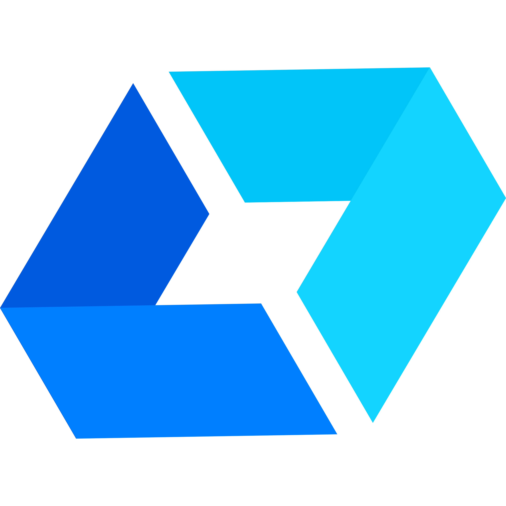
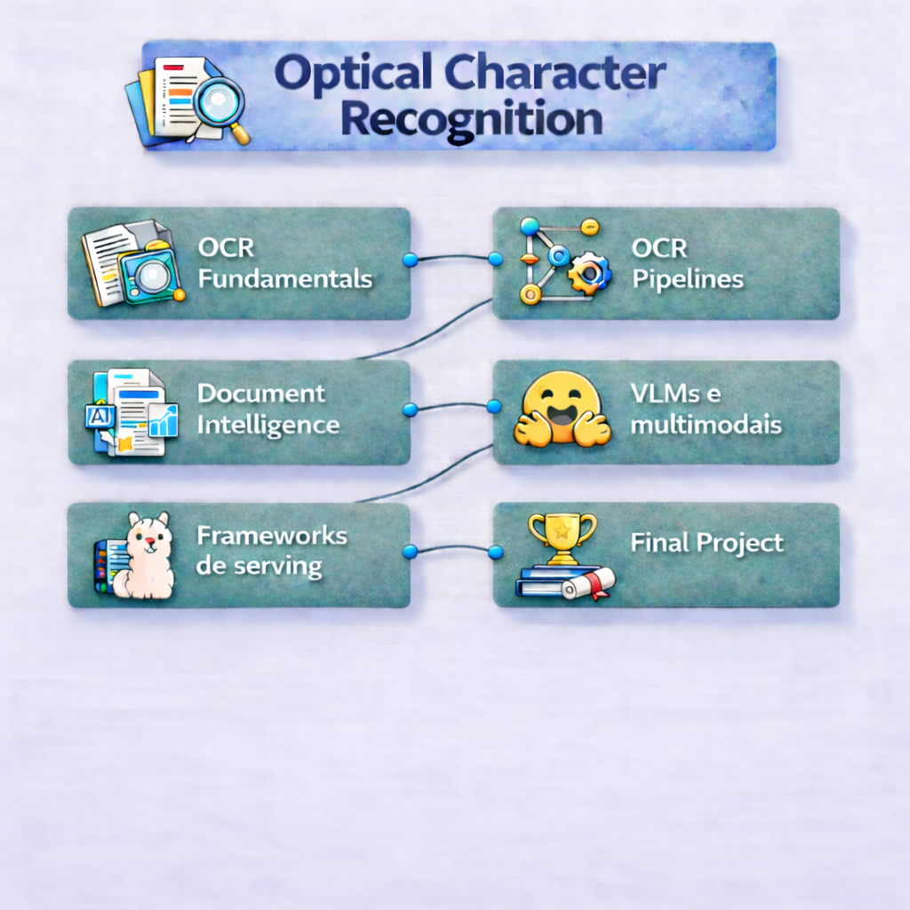

    

# 🔹Bloco 4: OCR Engineering — Do Fundamento à Produção

> Módulo completo de OCR para engenheiros de IA — abril de 2026  
> Do reconhecimento clássico de texto até pipelines com VLMs e modelos de linguagem multimodais.

  
  
  
  
  
  
  
  
  

### Tecnologias e padrões utilizados ao longo do módulo

OCR pipelines • Document AI • Vision-Language Models (VLMs) • parsing de PDFs e imagens  
extração estruturada de documentos • inferência local de modelos • otimização de hardware  
processamento de documentos em larga escala • avaliação de extração de dados

## 📚 Ementa do Módulo

### [Módulo 1: OCR Fundamentals](./01-ocr-fundamentals)
- **O que é OCR de verdade:** Texto + layout + estrutura (não só caracteres).
- **Como funciona:** Pipeline básico de OCR (detecção → reconhecimento).
- **Desafios reais:** Rotação, baixa qualidade, ruído, caligrafia e documentos complexos.
- **Métricas:** CER vs WER — quando usar cada uma e limitações práticas.

### [Módulo 2: OCR Pipelines](./02-ocr-pipelines)
- **Componentes do pipeline:** Pré-processamento, OCR e pós-processamento.
- **Ferramentas principais:** Tesseract, Azure Document Intelligence e Vision LLMs.
- **Chunking e estruturação:** Como preparar saída para uso downstream (LLMs, busca, etc.).
- **Tradeoffs:** Qualidade vs custo vs latência entre abordagens.

### [Módulo 3: Document Intelligence](./03-document-intelligence)
- **Arquitetura end-to-end:** Ingestão, filas, workers e indexação.
- **Processamento confiável:** Idempotência e controle de duplicidade.
- **Tratamento de falhas:** Retries, Dead Letter Queues e recuperação.
- **Observabilidade:** Logs, métricas e alertas para pipelines de documentos.

### [Módulo 4: VLMs especializados e multimodais](./04-vlm-multimodals)
- **Fundamentos:** Como funcionam Transformers em contexto multimodal.
- **Tokenização e inputs visuais:** Como imagens viram tokens.
- **Formatos e otimização:** FP16, INT8, GGUF, AWQ — impacto em performance.
- **Quando usar VLMs:** Casos ideais vs OCR tradicional.

### [Módulo 5: Frameworks de serving](./05-serving-frameworks)
- **Execução local:** Rodando modelos (ex: Llama) em ambiente local.
- **Servidores de inferência:** vLLM, TGI e alternativas.
- **Escalabilidade:** Batch, streaming e uso eficiente de GPU.
- **Ambientes:** Diferença entre protótipo, staging e produção.

### [Módulo 6: Final Project](./06-final-project)
- **Infraestrutura:** Importância de VRAM e escolha de hardware.
- **Custos:** Comparação entre self-hosted vs APIs.
- **Otimização:** Quantização e impacto em qualidade/performance.
- **Entrega:** Construção de um pipeline completo de Document Intelligence.
---

## Sobre o módulo

Este módulo cobre toda a jornada de um engenheiro de IA que precisa trabalhar com OCR em projetos reais: da compreensão de como o reconhecimento óptico de caracteres funciona até a entrega de um pipeline em produção usando os frameworks e modelos mais modernos disponíveis em 2026.

O curso é **orientado a projetos**. Cada aula termina com um laboratório prático que conecta conteúdo teórico a um problema real de engenharia. Ao final das 6 aulas, o aluno terá construído os blocos de um pipeline completo de OCR — da ingestão de documentos até a extração estruturada de dados e integração com sistemas de busca.

**Pré-requisitos:** Python intermediário, familiaridade com conceitos básicos de machine learning e noções de uso de terminal.

---

## O que você vai aprender

### Fundamentos
- Como o OCR funciona em nível de sinal: binarização, segmentação, extração de features
- Diferenças entre Tesseract e EasyOCR — quando usar cada um
- Como qualidade de dados determina qualidade de resultados
- Técnicas de pré-processamento de imagens de documentos

### Document Intelligence
- O que separa OCR simples de compreensão de documentos
- Como frameworks como Docling unificam detecção de layout, OCR e exportação estruturada
- Integração do Docling com LangChain, LlamaIndex e pipelines de RAG
- Extração de tabelas, fórmulas, código e leitura de ordem em documentos complexos

### Modelos e arquiteturas
- A evolução da família Qwen-VL: Qwen2-VL → Qwen2.5-VL → Qwen3-VL
- DeepSeek-OCR e DeepSeek-OCR 2: compressão óptica de contexto e eficiência de tokens
- GLM-OCR: 0.9B parâmetros, #1 no OmniDocBench V1.5, Multi-Token Prediction
- Mistral OCR, Surya, GOT-OCR2 e Florence-2
- Como avaliar e comparar modelos com benchmarks (OmniDocBench, DocBench, FUNSD, SROIE)

### Frameworks de serving
- **HuggingFace** — `transformers`, pipelines de inferência, Inference Endpoints
- **Ollama** — deploy local de modelos multimodais para desenvolvimento e edge
- **vLLM** — serving de alta performance com PagedAttention e batching contínuo

### Produção
- Arquitetura de um pipeline de OCR de ponta a ponta com roteamento inteligente
- Docling como camada de ingestão de documentos em pipelines de RAG
- Pós-processamento, extração de campos e validação de dados
- Boas práticas de observabilidade e tratamento de erros

---

## Tecnologias e ferramentas

### OCR clássico e visão computacional
- [Tesseract OCR](https://github.com/tesseract-ocr/tesseract) — motor OCR open source mais consolidado
- [pytesseract](https://github.com/madmaze/pytesseract) — wrapper Python para o Tesseract
- [EasyOCR](https://github.com/JaidedAI/EasyOCR) — OCR simples com suporte a 80+ idiomas, baseado em deep learning
- [OpenCV](https://opencv.org/) — pré-processamento de imagens

### Document Intelligence
- [Docling](https://github.com/docling-project/docling) — framework da IBM para conversão de documentos com suporte a RAG
- [Granite-Docling](https://huggingface.co/ibm-granite/granite-docling-258M) — VLM compacto (258M) integrado ao Docling
- [PaddleOCR](https://github.com/PaddlePaddle/PaddleOCR) — OCR multilíngue de alta performance
- [DocTR](https://github.com/mindee/doctr) — detecção e reconhecimento separados

### Modelos especializados em OCR (2024–2026)
- [GOT-OCR2](https://huggingface.co/stepfun-ai/GOT-OCR2_0) — end-to-end para documentos complexos (2024)
- [Surya](https://github.com/VikParuchuri/surya) — OCR com suporte a 90+ idiomas
- [DeepSeek-OCR](https://huggingface.co/deepseek-ai/DeepSeek-OCR) — compressão óptica de contexto, 3B params (out/2025)
- [DeepSeek-OCR 2](https://huggingface.co/deepseek-ai/DeepSeek-OCR-2) — DeepEncoder V2, Visual Causal Flow (jan/2026)
- [GLM-OCR](https://huggingface.co/zai-org/GLM-OCR) — 0.9B params, #1 OmniDocBench V1.5, Zhipu AI (fev/2026)
- [Mistral OCR](https://mistral.ai/news/mistral-ocr) — API de alta precisão, suporte nativo a PDF (mar/2025)

### VLMs multimodais gerais com forte capacidade de OCR
- [Qwen2-VL](https://huggingface.co/Qwen/Qwen2-VL-7B-Instruct) — base da família (set/2024)
- [Qwen2.5-VL](https://huggingface.co/Qwen/Qwen2.5-VL-7B-Instruct) — melhorias em documentos e agência (jan/2025)
- [Qwen3-VL](https://huggingface.co/Qwen/Qwen3-VL-8B-Instruct) — 32 idiomas, MoE, contexto 256K (out/2025)
- [Florence-2](https://huggingface.co/microsoft/Florence-2-large) — modelo unificado da Microsoft
- [TrOCR](https://huggingface.co/microsoft/trocr-large-printed) — transformer para reconhecimento de linhas

### Frameworks de serving
- [HuggingFace Transformers](https://huggingface.co/docs/transformers) — carregamento e inferência
- [HuggingFace Datasets](https://huggingface.co/docs/datasets) — datasets prontos para OCR
- [Ollama](https://ollama.com/) — deploy local simplificado
- [vLLM](https://docs.vllm.ai/) — serving de alta performance com PagedAttention

### Manipulação de documentos
- [PyMuPDF (fitz)](https://pymupdf.readthedocs.io/) — leitura e rasterização de PDFs
- [pdfplumber](https://github.com/jsvine/pdfplumber) — extração de texto e tabelas de PDFs
- [Albumentations](https://albumentations.ai/) — augmentação de imagens
- [Augraphy](https://github.com/sparkfish/augraphy) — simulação de degradação de documentos

### Avaliação e anotação
- [Label Studio](https://labelstud.io/) — anotação open source
- [jiwer](https://github.com/jitsi/jiwer) — cálculo de WER e CER

---

## Datasets de referência

| Dataset | Tarefa | Link |
|---------|--------|------|
| FUNSD | Compreensão de formulários | [HuggingFace](https://huggingface.co/datasets/nielsr/funsd) |
| SROIE | Entidades em recibos | [HuggingFace](https://huggingface.co/datasets/darentang/sroie) |
| DocVQA | Perguntas sobre documentos | [HuggingFace](https://huggingface.co/datasets/HuggingFaceM4/DocumentVQA) |
| CORD | Recibos estruturados | [HuggingFace](https://huggingface.co/datasets/naver-clova-ix/cord-v2) |
| RVL-CDIP | Classificação de documentos | [HuggingFace](https://huggingface.co/datasets/rvl_cdip) |
| OmniDocBench | Benchmark abrangente (2025) | [GitHub](https://github.com/opendatalab/OmniDocBench) |

---

## Referências e leitura complementar

### Artigos fundamentais
- [TrOCR: Transformer-based Optical Character Recognition (Microsoft, 2021)](https://arxiv.org/abs/2109.10282)
- [General OCR Theory: Towards OCR-2.0 — GOT-OCR2 (2024)](https://arxiv.org/abs/2409.01704)
- [DeepSeek-OCR: Contexts Optical Compression (out/2025)](https://arxiv.org/abs/2510.18234)
- [DeepSeek-OCR 2: Visual Causal Flow (jan/2026)](https://arxiv.org/abs/2601.20552)
- [Qwen2.5-VL Technical Report (2025)](https://arxiv.org/abs/2502.13923)
- [Qwen3-VL Technical Report (nov/2025)](https://arxiv.org/abs/2511.21631)
- [GLM-OCR Technical Report (mar/2026)](https://arxiv.org/abs/2603.10910)
- [Docling Technical Report (2024)](https://arxiv.org/abs/2408.09869)
- [Florence-2: Advancing a Unified Representation (Microsoft, 2023)](https://arxiv.org/abs/2311.06242)

### Documentação oficial
- [Docling — Documentação](https://docling-project.github.io/docling/)
- [HuggingFace Transformers](https://huggingface.co/docs/transformers/index)
- [vLLM — Documentação](https://docs.vllm.ai/en/latest/)
- [Ollama — Modelos com visão](https://ollama.com/blog/vision-models)
- [Tesseract — Improving Quality](https://tesseract-ocr.github.io/tessdoc/ImproveQuality.html)
- [Mistral OCR — Documentação](https://docs.mistral.ai/capabilities/document/)
- [GLM-OCR — GitHub](https://github.com/zai-org/GLM-OCR)
- [DeepSeek-OCR — GitHub](https://github.com/deepseek-ai/DeepSeek-OCR)

---

## 🚀 Como começar
Vá para **[Módulo 1: OCR Fundamentals](./01-ocr-fundamentals)**.
