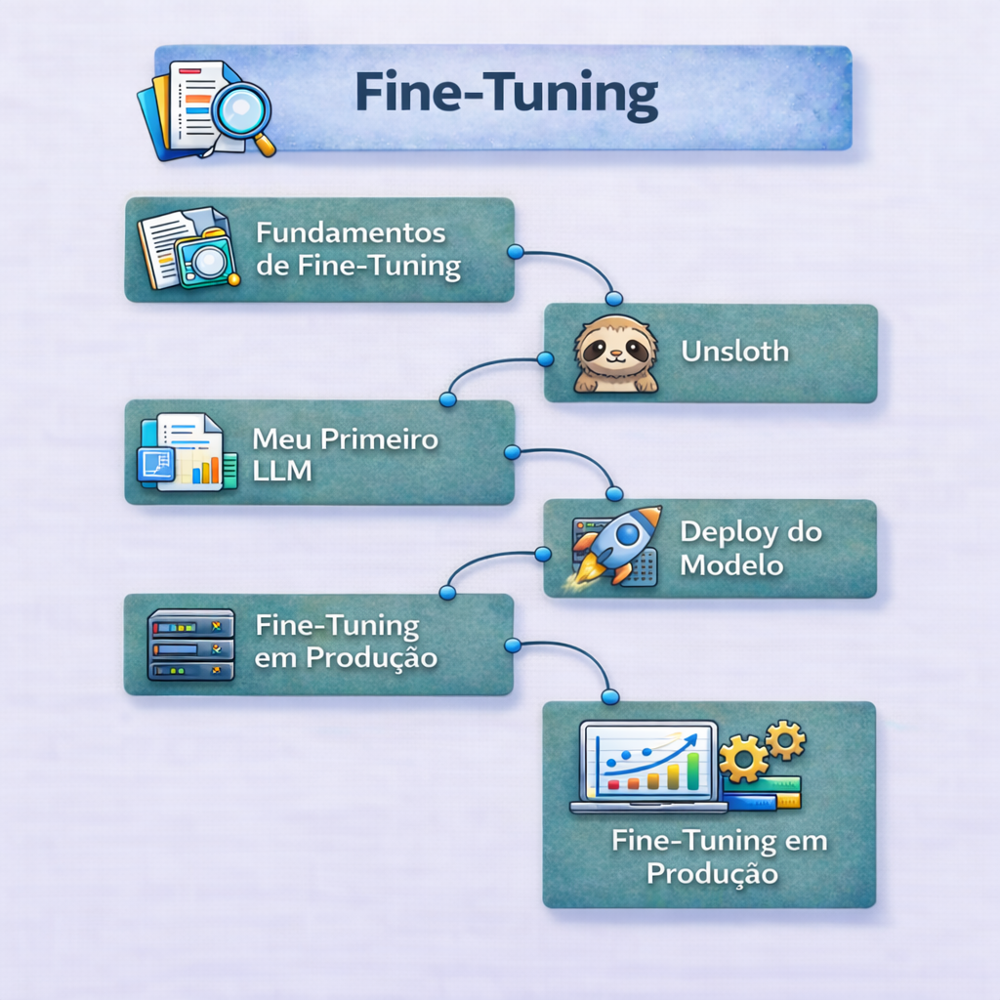

    

# 🔹 Bloco 5: Fine-Tuning e Melhora de Modelo

> **Objetivo:** Saber quando treinar — e principalmente quando NÃO treinar.  
> **Status:** A última milha da especialização.

  
  
  
  
  
  

### Tecnologias e padrões utilizados ao longo do módulo

fine-tuning de LLMs • dataset curation • SFT (Supervised Fine-Tuning)  
LoRA / QLoRA • treinamento eficiente em GPU  
preparação e formatação de datasets • avaliação de modelos  
deploy e inferência otimizada

## 📚 Ementa do Módulo

### [Módulo 1: Fundamentos de Fine-Tuning](./01-fine-tuning-fundamentals)
- **Realidade:** Adaptação de pesos vs Injeção de Conhecimento.
- **Matriz de Decisão:** Fine-Tuning vs RAG vs Prompting.
- **Tipos de Adaptação:** LoRA, QLoRA, PEFT e Full Fine-Tuning.

### [Módulo 2: Unsloth](./02-unsloth)
- **A Ferramenta:** Por que Unsloth é o padrão ouro hoje.
- **Eficiência:** Treinando 2x mais rápido com 70% menos memória.
- **Workflow:** Do notebook para o GGUF/LoRA Adapter.

### [Módulo 3: Meu Primeiro LLM — Dataset, Preparação, Treinamento dos dados](./03-my-first-llm)
- **Dados são o Modelo:** Qualidade > Quantidade. Instruction Datasets.
- **Preparação:** Como formatar seus dados corretamente.
- **Avaliação:** Baselines e LLM-as-a-Judge (GPT-4 como juiz).

### [Módulo 4: Deploy do Modelo](./04-model-deploy)
- **Adapters:** Como carregar LoRA adapters no vLLM.
- **Merge:** Quando fundir os pesos (Mergekit) e quando carregar dinamicamente.

### [Módulo 5: Fine-Tuning em Produção](./05-fine-tuning-production)
- **Ops:** Infraestrutura de treino, Spot Instances e custos reais.
- **Riscos:** Catastrophic Forgetting e manutenção de modelos "congelados".
- **Enterprise:** Compliance, Governança e Privacidade.

---

## 🛠️ Stack de Treino (Padrão 2025)

| Componente | Escolha | Por quê? |
|:---|:---|:---|
| **Framework** | Unsloth | Velocidade e eficiência de memória imbatíveis. |
| **Técnica** | QLoRA (4-bit) | Permite treinar 70B em GPUs "baratas" (A6000/A100). |
| **Eval** | Ragas / LLM-as-Judge | Avaliação escalável antes de deploy. |
| **Dataset** | Hugging Face Datasets | Gerenciamento e versionamento de dados. |

## 🧠 Mudanças Mentais Necessárias
- **Menos é Mais:** Comece com 50 exemplos. Teste. Se melhorar, adicione mais.
- **Dados são Código:** Trate seu dataset com o mesmo rigor que trata seu código (versionamento, code review, linting).
- **Você provavelmente não precisa de Fine-Tuning:** Sério. RAG + Few-Shot Prompting resolve 95% dos casos.

## 🚀 Como começar
Vá para **[Módulo 1: Fundamentos de Fine-Tuning](./01-fine-tuning-fundamentals)**.

### 6. Inference optimization

Text generation is a costly process that requires expensive hardware. In addition to quantization, various techniques have been proposed to maximize throughput and reduce inference costs.

* **Flash Attention**: Optimization of the attention mechanism to transform its complexity from quadratic to linear, speeding up both training and inference.
* **Key-value cache**: Understand the key-value cache and the improvements introduced in [Multi-Query Attention](https://arxiv.org/abs/1911.02150) (MQA) and [Grouped-Query Attention](https://arxiv.org/abs/2305.13245) (GQA).
* **Speculative decoding**: Use a small model to produce drafts that are then reviewed by a larger model to speed up text generation. EAGLE-3 is a particularly popular solution.

📚 **References**:
* [GPU Inference](https://huggingface.co/docs/transformers/main/en/perf_infer_gpu_one) by Hugging Face: Explain how to optimize inference on GPUs.
* [LLM Inference](https://www.databricks.com/blog/llm-inference-performance-engineering-best-practices) by Databricks: Best practices for how to optimize LLM inference in production.
* [Optimizing LLMs for Speed and Memory](https://huggingface.co/docs/transformers/main/en/llm_tutorial_optimization) by Hugging Face: Explain three main techniques to optimize speed and memory, namely quantization, Flash Attention, and architectural innovations.
* [Assisted Generation](https://huggingface.co/blog/assisted-generation) by Hugging Face: HF's version of speculative decoding. It's an interesting blog post about how it works with code to implement it.
* [EAGLE-3 paper](https://arxiv.org/abs/2503.01840?utm_source=chatgpt.com): Introduces EAGLE-3 and reports speedups up to 6.5×.
* [Speculators](https://github.com/vllm-project/speculators): Library made by vLLM for building, evaluating, and storing speculative decoding algorithms (e.g., EAGLE-3) for LLM inference.