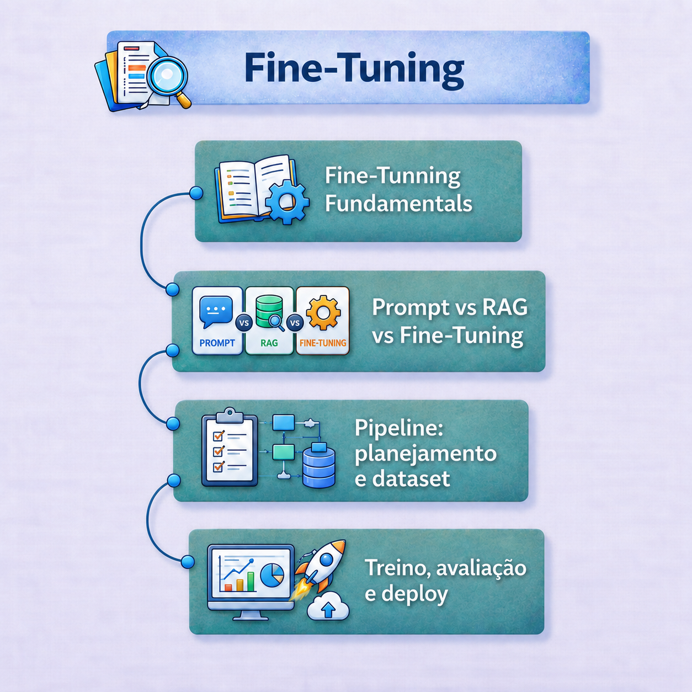

    

# 🔹Bloco 5: Fine-Tuning de LLMs — Do Fundamento ao Deploy Local

> Módulo completo de Fine-Tuning para engenheiros de IA — maio de 2026
> Do entendimento conceitual de adaptação de pesos até o deploy de um modelo customizado servindo via API compatível com OpenAI.

  
  
  
  
  
  
  
  

### Tecnologias e padrões utilizados ao longo do módulo

LoRA / QLoRA • PEFT • SFT (Supervised Fine-Tuning) • dataset sintético com LLM
loss masking • avaliação estrutural além da loss • merge de adapters
quantização GGUF (f16, q8_0, q4_k_m) • serving local com llama.cpp
API OpenAI-compatible • deploy on-prem

## 📚 Ementa do Módulo

### [Aula 1: Fundamentos de Fine-Tuning](./01-fine-tuning-fundamentals)
- **As três fases de um LLM:** pré-treino, instruction tuning e fine-tuning — o que cada uma faz e o que custa.
- **O que FT realmente faz:** formato, estilo e convenções de domínio — e o que ele **não** faz.
- **As três famílias:** Full Fine-Tuning, LoRA e QLoRA — matemática, custo de VRAM e quando usar cada uma.
- **Catastrophic forgetting:** por que LoRA é seguro por construção.
- **As 5 perguntas antes de uma linha de código:** tarefa, modelo, dataset, hardware, métrica.

### [Aula 2: Raio-X — Prompt vs RAG vs Fine-Tuning](./02-x-ray-fine-tunning)
- **Comparação técnica em 5 eixos:** o que cada técnica muda, custo, latência, atualização e tipo de aprendizado.
- **Framework de decisão:** fluxograma na ordem certa para escolher a abordagem inicial.
- **Pipeline híbrido:** por que sistemas reais quase sempre combinam RAG + FT.
- **Anti-padrões reais:** "fine-tunei nos meus PDFs e ele não sabe nada deles" e outros erros recorrentes.
- **Memória semântica (RAG) vs memória procedural (FT):** ensina **O QUE** vs ensina **COMO**.

### [Aula 3: Pipeline — Planejamento e Dataset](./03-pipeline)
- **O PRD do fine-tuning:** congelando decisões antes de gastar GPU.
- **Escolha de modelo base:** cinco critérios em ordem de importância.
- **Schema de output como contrato:** vocabulário fechado, formatos canônicos, paranoia controlada.
- **Estratégia structure-first:** amostrar a estrutura primeiro, deixar o LLM redigir o texto depois.
- **Geração sintética com Claude:** loop de geração, validação automática de cobertura, negativos.

### [Aula 4: Treino, Avaliação e Deploy Local](./04-train-deploy)
- **Configuração LoRA:** rank, alpha, target_modules — racional de cada escolha.
- **Hiperparâmetros do treino:** batch efetivo, cosine scheduler, warmup, bf16, gradient checkpointing.
- **Loss masking:** o detalhe que mais gente erra — usando `label = -100` para esconder o prefixo.
- **Métricas estruturais:** JSON validity, schema validity, exact-match, F1, FP em negativos.
- **Deploy local:** merge LoRA → conversão GGUF → `llama-server` → cliente com a lib OpenAI normal.

---

## Sobre o módulo

Este módulo cobre toda a jornada de um engenheiro de IA que precisa fine-tunar um LLM para uma tarefa específica em produção: do entendimento conceitual de como adaptação de pesos funciona até a entrega de um modelo servido localmente via API compatível com OpenAI, pronto para ser consumido por qualquer framework que já fala com `gpt-4o`.

O curso é **orientado a projeto**. As aulas 1 e 2 são conceituais e construtoras do modelo mental; as aulas 3 e 4 entregam um pipeline real, ponta a ponta, executando em uma RTX 3060 com 12 GB de VRAM. O caso prático escolhido é extração estruturada de citações de leis brasileiras em JSON estrito — paradigmático de onde fine-tuning brilha (formato + alto volume + dados privados + conhecimento estável).

Ao final das 4 aulas, o aluno terá fine-tunado seu próprio LLM, avaliado com métricas estruturais reais e feito deploy local servindo via API compatível com OpenAI.

**Pré-requisitos:** Python intermediário, familiaridade com Hugging Face Transformers, noções de PyTorch e uma GPU com pelo menos 6-8 GB de VRAM (ideal: 12 GB).

---

## O que você vai aprender

### Fundamentos
- O que muda em um modelo durante fine-tuning — em nível de parâmetros
- Diferença entre pré-treino, instruction tuning e fine-tuning supervisionado
- Por que LoRA tem rank intrínseco baixo e como isso reduz parâmetros treináveis em ~100x
- Como QLoRA viabiliza fine-tuning de modelos de 65B em GPU única de 48 GB
- Catastrophic forgetting e como LoRA mitiga isso por construção

### Decisão arquitetural
- Quando usar Prompt Engineering, RAG ou Fine-Tuning — e quando combinar
- Eixos de custo, latência, atualização de conhecimento e tipo de aprendizado
- Anti-padrões clássicos e como reconhecê-los antes de gastar tempo
- Pipelines híbridos: RAG fornece o "o quê", FT garante o "como"

### Engenharia de dataset
- Como escrever um PRD que congela decisões antes da implementação
- Critérios para escolher o modelo base certo para sua tarefa
- Como definir um schema estrito como contrato entre modelo e consumidor
- Estratégia structure-first para gerar datasets sintéticos com ground truth por design
- Validação automática de cobertura para eliminar ruído sem revisão manual
- A importância de negativos (~18%) para evitar alucinação de referências

### Treino e avaliação
- Configuração de LoRA: rank, alpha, target_modules e seus trade-offs
- Hiperparâmetros que importam: learning rate, warmup, scheduler, batch efetivo
- **Loss masking** com `label = -100` — o ponto mais frequentemente esquecido
- Smoke test antes do treino real e como interpretar a curva de loss
- Métricas estruturais além da loss: JSON validity, exact-match, F1 por campo, FP em negativos
- Por que `do_sample=False` é essencial para avaliação reprodutível

### Deploy em produção
- Merge de adapters LoRA com o modelo base para gerar pesos standalone
- Conversão para GGUF: escolha entre f16, q8_0 e q4_k_m
- Servir com `llama-server` em API compatível com OpenAI
- Como apontar `OpenAI(base_url=...)` para o servidor local — e o que isso destrava
- Caminhos para escalar: vLLM, quantização int4, cache, batches assíncronos

---

## Tecnologias e ferramentas

### Treino e PEFT
- [Hugging Face Transformers](https://huggingface.co/docs/transformers) — `Trainer`, `AutoModelForCausalLM`, tokenizers
- [PEFT](https://github.com/huggingface/peft) — biblioteca oficial para LoRA, QLoRA e outros adapters
- [Datasets](https://huggingface.co/docs/datasets) — carregamento e tokenização do `train.jsonl`
- [bitsandbytes](https://github.com/TimDettmers/bitsandbytes) — quantização 4-bit (NF4) para QLoRA
- [Unsloth](https://github.com/unslothai/unsloth) — alternativa otimizada quando o ambiente permite

### Modelos base
- [Qwen2.5-Coder-1.5B-Instruct](https://huggingface.co/Qwen/Qwen2.5-Coder-1.5B-Instruct) — escolha do curso (Apache 2.0, ótimo em JSON, pt-BR decente)
- [Llama 3.2](https://huggingface.co/meta-llama/Llama-3.2-1B) — alternativa com pt-BR forte
- [Phi-3.5-mini](https://huggingface.co/microsoft/Phi-3.5-mini-instruct) — pequeno e rápido (pt-BR mais fraco)

### Geração de dataset sintético
- [Anthropic Claude API](https://docs.anthropic.com/en/api/messages) — Claude Haiku para geração de exemplos (~USD 0.005 por exemplo)
- Pipeline `structure-first` próprio: catálogo curado + amostragem ponderada + validação automática

### Deploy e serving
- [llama.cpp](https://github.com/ggerganov/llama.cpp) — inferência em C/C++, roda nativo em Windows
- [GGUF](https://github.com/ggerganov/ggml/blob/master/docs/gguf.md) — formato binário usado pelo llama.cpp
- [llama-server](https://github.com/ggerganov/llama.cpp/tree/master/tools/server) — API OpenAI-compatible built-in
- [OpenAI Python SDK](https://github.com/openai/openai-python) — cliente final (basta trocar `base_url`)
- [vLLM](https://docs.vllm.ai/) — alternativa de alto throughput para servidor Linux

### Tooling
- [uv](https://github.com/astral-sh/uv) — gerenciador de pacotes Python usado no curso
- [PyTorch](https://pytorch.org/) — backend de treino (bf16 em GPUs Ampere+)

---

## Repositório de referência

| Recurso | Link |
|---------|------|
| Código completo do projeto prático | [caio-moliveira/ai-engineer-fine-tuning-example](https://github.com/caio-moliveira/ai-engineer-fine-tuning-example) |
| Documento técnico completo | [`docs/CURSO_FINE_TUNING.md`](https://github.com/caio-moliveira/ai-engineer-fine-tuning-example/blob/main/docs/CURSO_FINE_TUNING.md) |

---

## Referências e leitura complementar

### Artigos fundamentais
- [Wei et al. (2021) — Finetuned Language Models Are Zero-Shot Learners (FLAN)](https://arxiv.org/abs/2109.01652)
- [Ouyang et al. (2022) — Training Language Models to Follow Instructions (InstructGPT)](https://arxiv.org/abs/2203.02155)
- [Hu et al. (2021) — LoRA: Low-Rank Adaptation of Large Language Models](https://arxiv.org/abs/2106.09685)
- [Dettmers et al. (2023) — QLoRA: Efficient Finetuning of Quantized LLMs](https://arxiv.org/abs/2305.14314)
- [Houlsby et al. (2019) — Parameter-Efficient Transfer Learning for NLP](https://arxiv.org/abs/1902.00751)
- [Lewis et al. (2020) — Retrieval-Augmented Generation for Knowledge-Intensive NLP Tasks](https://arxiv.org/abs/2005.11401)
- [Wang et al. (2022) — Self-Instruct: Aligning LMs with Self-Generated Instructions](https://arxiv.org/abs/2212.10560)
- [Rafailov et al. (2023) — Direct Preference Optimization](https://arxiv.org/abs/2305.18290)
- [Hoffmann et al. (2022) — Training Compute-Optimal Large Language Models (Chinchilla)](https://arxiv.org/abs/2203.15556)

### Documentação oficial
- [Hugging Face Transformers — Trainer](https://huggingface.co/docs/transformers/main_classes/trainer)
- [Hugging Face PEFT](https://github.com/huggingface/peft)
- [Qwen2.5 Technical Report](https://arxiv.org/abs/2412.15115)
- [Anthropic Claude API — Messages](https://docs.anthropic.com/en/api/messages)
- [llama.cpp](https://github.com/ggerganov/llama.cpp)
- [GGUF specification](https://github.com/ggerganov/ggml/blob/master/docs/gguf.md)
- [OpenAI API — Chat Completions](https://platform.openai.com/docs/api-reference/chat)

---

## 🚀 Como começar
Vá para **[Aula 1: Fundamentos de Fine-Tuning](./01-fine-tuning-fundamentals)**.
