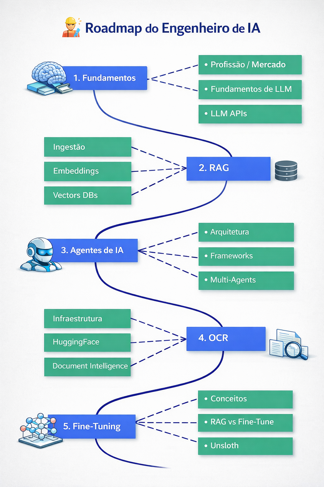

<div align="center">
  

# **Trilha Completa: Engenharia de IA**

### Construção profissional de sistemas de IA, RAGs e agentes em produção

**Formação prática focada em arquitetura, orquestração, observabilidade e deploy de aplicações de IA modernas**

</div>

---

<div align="center">

[](https://opensource.org/licenses/MIT)
[](https://www.python.org/)

[**Site Oficial**](https://suajornadadedados.com.br/) • [**Comunidade**](https://suajornadadedados.com.br/) • [**Documentação**](https://suajornadadedados.com.br/)
</div>

---

## 🚀 O Manifesto do Engenheiro de IA (Edição 2026)

O mercado de "Power Users" de chat saturou. Em 2026, a barreira de entrada não é mais saber o que é um prompt, mas sim como garantir **determinismo, segurança e custo-eficiência** em sistemas não-determinísticos.

### 🎯 Onde você se posiciona?
Diferente do **Cientista de Dados** (focado em *Training & Fine-tuning*) e do **ML Engineer** (focado em *Infrastructure & Serving*), o **AI Engineer** é o engenheiro de software especializado na composição de Modelos de Fundação.

> **"Nossa missão não é criar inteligência bruta, mas arquitetar o contexto necessário para que ela seja útil."**

### 💎 Pilares da Engenharia de IA Moderna

Para mover o ponteiro em projetos reais, atacamos os três pilares que separam demos de produtos:

1.  **Fidelidade (Grounding):** Implementação de RAG (Retrieval-Augmented Generation) multicamadas para eliminar alucinações.
2.  **Autonomia (Agency):** Evolução de fluxos lineares para grafos cíclicos com **LangGraph**, permitindo raciocínio complexo e correção de erros em tempo real.
3.  **LLMOps & Observabilidade:** Se você não mede, você não gerencia. Utilizamos **Langfuse** e **Arize Phoenix** para rastreabilidade total de tokens, latência e custo.

---

## 🛠️ O Tech Stack do Especialista
Não ensinamos apenas ferramentas; ensinamos os padrões de design de software aplicados à IA:

* **Linguagem & Base:** Python Pro (AsyncIO), Pydantic (Validação de Dados) e Docker.
* **Vector Architecture:** Qdrant, Pinecone e ChromaDB para busca semântica e híbrida.
* **Orquestração de Estado:** LangChain e LangGraph para fluxos de agentes com memória persistente.
* **Engenharia de Prompt:** Chain-of-Thought, Few-shot prompting e técnicas de compressão de contexto.

---

## 📚 A Trilha de Formação
<div align="center">

</div>


## 🧱 [Bloco 1 — Fundamentos da Engenharia de IA](./01-fundamentals)

A base necessária para construir aplicações modernas de IA em produção.

Este bloco ensina como desenvolver software quando o núcleo do sistema é probabilístico, caro e dependente de inferência externa.

### 🎯 Você vai aprender

✔ funcionamento operacional de LLMs  
✔ arquitetura Python para aplicações de IA  
✔ APIs assíncronas e serviços escaláveis  
✔ contratos estruturados de dados  
✔ integração SQL + Vector DB

---

### 📦 Módulos

| #  | Módulo                                                               | Tema                               |
| -- | -------------------------------------------------------------------- | ---------------------------------- |
| 01 | [Profissão AI Engineer](./01-fundamentals/01-ai-engineer-profession) | Mercado e papel profissional       |
| 02 | [Fundamentos de LLMs](./01-fundamentals/02-llm-fundamentals)         | Tokenização, contexto e geração    |
| 03 | [Python Moderno](./01-fundamentals/03-python-for-ai)                 | Ambiente, tipagem e arquitetura    |
| 04 | [FastAPI Backend](./01-fundamentals/04-fastapi)                      | APIs assíncronas                   |
| 05 | [Modelagem de Dados](./01-fundamentals/05-data-modeling)             | JSON Schema e outputs estruturados |
| 06 | [Bancos SQL + Vetoriais](./01-fundamentals/06-databases)             | Armazenamento híbrido              |

---

## 📚 [Bloco 2 — Sistemas RAG](./02-rag)

Este bloco ensina como conectar modelos de IA a dados reais.

RAG em produção envolve ingestão robusta, busca híbrida, avaliação contínua e arquitetura observável.

### 🎯 Você vai aprender

✔ pipeline completo de ingestão de documentos  
✔ chunking profissional e modelagem semântica  
✔ embeddings modernos e indexação vetorial  
✔ estratégias híbridas de retrieval  
✔ avaliação automática com RAGAS  
✔ deploy seguro e otimizado

---

### 📦 Módulos

| #  | Módulo                                                               | Tema                    |
| -- | -------------------------------------------------------------------- | ----------------------- |
| 01 | [Fundamentos de RAG](./02-rag/01-rag-fundamentals)                   | Arquitetura mental      |
| 02 | [Ingestão e Pipelines](./02-rag/02-ingestion-pipeline)               | ETL para IA             |
| 03 | [Embeddings](./02-rag/03-embeddings)                                 | Representação semântica |
| 04 | [Vector DBs](./02-rag/04-vector-dbs)                                 | Indexação e performance |
| 05 | [Retrieval Strategies](./02-rag/05-retrievers)                       | Hybrid + reranking      |
| 06 | [RAG Agents](./02-rag/06-rag-agent)                                  | LangChain vs LlamaIndex |
| 07 | [Graph RAG](./02-rag/07-graph-rag)                                   | Knowledge Graphs        |
| 08 | [Avaliação](./02-rag/08-evaluation)                                  | RAGAS + tracing         |
| 09 | [RAG em Produção](./02-rag/10-rag-production)                        | Segurança e custos      |

---

## 🤖 [Bloco 3 — Sistemas de Agentes de IA](./03-ai-agents)

Agentes são sistemas de software com autonomia controlada.

Este bloco ensina como projetar, orquestrar e operar agentes confiáveis em produção.

### 🎯 Você vai aprender

✔ diferença real entre workflow e agente  
✔ arquiteturas modernas de agentes  
✔ tool calling estruturado  
✔ grafos de estado com LangGraph  
✔ memória persistente  
✔ multi-agent design  
✔ guardrails e segurança

---

### 📦 Módulos

| #  | Módulo                                                       | Tema                        |
| -- | ------------------------------------------------------------ | --------------------------- |
| 01 | [O que são agentes](./03-ai-agents/01-agent-definitions)     | Definição real              |
| 02 | [Arquiteturas](./03-ai-agents/02-agent-architectures)        | Patterns ReAct / Reflection |
| 03 | [LangChain Agents](./03-ai-agents/03-langchain-agents)       | Tool calling                |
| 04 | [LangGraph](./03-ai-agents/04-langgraph-orchestration)       | Orquestração real           |
| 05 | [Memory Systems](./03-ai-agents/05-memory-systems)           | Persistência                |
| 06 | [MCP Protocol](./03-ai-agents/06-mcp-protocol)               | Integrações modernas        |
| 07 | [Multi-Agent Systems](./03-ai-agents/07-multi-agent-systems) | Delegação e supervisão      |
| 08 | [Safety & Eval](./03-ai-agents/08-safety-evals)              | Guardrails                  |
| 09 | [Human-in-the-loop](./03-ai-agents/09-human-in-the-loop)     | Aprovação humana            |
| 10 | [Produção](./03-ai-agents/10-agents-in-production)           | Observabilidade             |


---

## 🖥️ [Bloco 4 — OCR](./04-infra-ocr-models)

Aqui a engenharia encontra o hardware e os pipelines de documentos.

Este bloco ensina como rodar modelos localmente, otimizar inferência e construir pipelines OCR robustos.

### 🎯 Você vai aprender

✔ decisão API vs Open Source  
✔ ecossistema Hugging Face real  
✔ inferência local e produção com vLLM  
✔ otimização de GPU e VRAM  
✔ fundamentos de OCR moderno  
✔ pipelines document intelligence

---

### 📦 Módulos

| #  | Módulo                                                                  | Tema                  |
| -- | ----------------------------------------------------------------------- | --------------------- |
| 01 | [Model Ecosystem](./04-infra-ocr-models/01-model-ecosystem)             | Estratégia de modelos |
| 02 | [Hugging Face](./04-infra-ocr-models/02-hugging-face)                   | Formatos e pipelines  |
| 03 | [Ollama](./04-infra-ocr-models/03-ollama)                               | Desenvolvimento local |
| 04 | [vLLM](./04-infra-ocr-models/04-vllm)                                   | Inferência produção   |
| 05 | [Hardware Performance](./04-infra-ocr-models/05-hardware-performance)   | Economia real         |
| 06 | [OCR Fundamentals](./04-infra-ocr-models/06-ocr-fundamentals)           | Layout + texto        |
| 07 | [OCR Pipelines](./04-infra-ocr-models/07-ocr-pipelines)                 | Arquitetura completa  |
| 08 | [Document Intelligence](./04-infra-ocr-models/08-document-intelligence) | Pipeline enterprise   |


---

## 🧪 [Bloco 5 — Fine-Tuning e Especialização de Modelos](./05-fine-tuning)

Este bloco ensina quando treinar modelos — e principalmente quando não treinar.

### 🎯 Você vai aprender

✔ diferença entre Fine-Tune e RAG  
✔ estratégias modernas de adaptação (LoRA, QLoRA)  
✔ preparação profissional de datasets  
✔ avaliação antes do treino  
✔ workflow completo com Unsloth  
✔ deploy e manutenção

---

### 📦 Módulos

| #  | Módulo                                                     | Tema                |
| -- | ---------------------------------------------------------- | ------------------- |
| 01 | [Conceitos](./05-fine-tuning/01-finetuning-concepts)       | O que é fine-tune   |
| 02 | [RAG vs Fine-Tune](./05-fine-tuning/02-rag-vs-finetuning)  | Matriz de decisão   |
| 03 | [Tipos de adaptação](./05-fine-tuning/03-adaptation-types) | LoRA, PEFT          |
| 04 | [Preparação de dados](./05-fine-tuning/04-data-prep)       | Dataset engineering |
| 05 | [Avaliação](./05-fine-tuning/05-evaluation)                | Baselines           |
| 06 | [Unsloth](./05-fine-tuning/06-unsloth)                     | Workflow real       |
| 07 | [Training Ops](./05-fine-tuning/07-training-ops)           | Infra e custos      |
| 08 | [Deploy](./05-fine-tuning/08-deploy-adapters)              | Adapters e merge    |
| 09 | [Riscos](./05-fine-tuning/09-risks-maintenance)            | Forgetting          |
| 10 | [Enterprise](./05-fine-tuning/10-enterprise-gov)           | Compliance          |

---

## 🚀 Como Começar

1. **Clone o repositório:**
   ```bash
   git clone https://github.com/seususuario/ai-engineer-roadmap.git
   cd ai-engineer-roadmap
   ```

2. **Configure o ambiente (usando `uv`):**
   ```bash
   # Recomendamos uv pela velocidade
   uv venv
   source .venv/bin/activate  # ou .venv\Scripts\activate no Windows
   uv pip install -r requirements.txt
   ```

3. **Navegue para o Bloco 1:**
   ```bash
   cd 01-foundations
   ```

## 🤝 Contribuindo
Exigimos padrões altos. Este não é um lugar para scripts "hello world".

## 📝 Licença
MIT. Construa coisas incríveis. Ganhe dinheiro. Mude o mundo.

