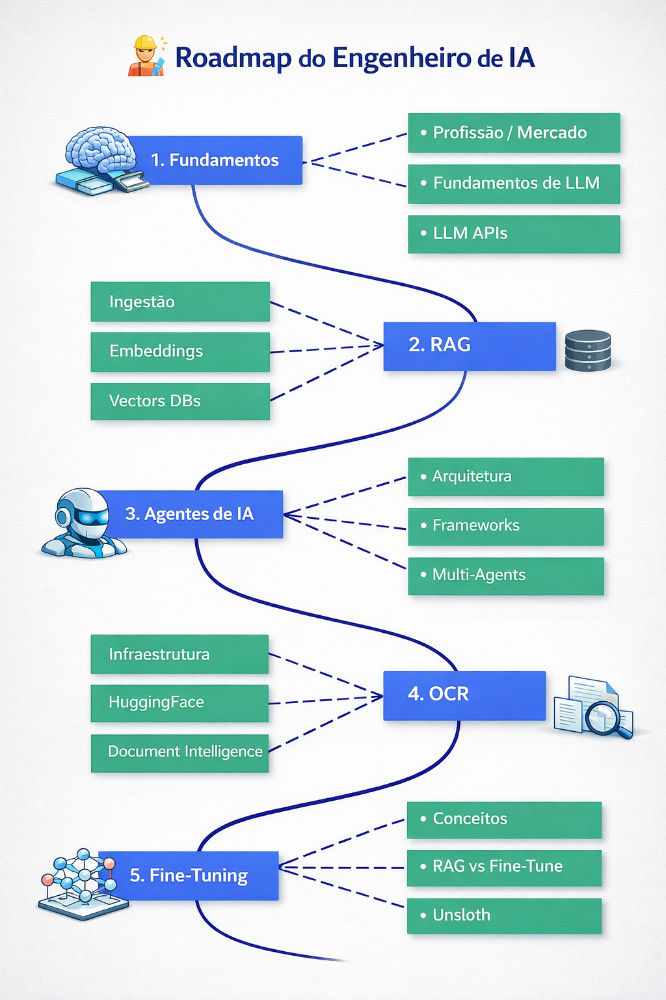

<div align="center">
  

[**Site Oficial**](https://suajornadadedados.com.br/) • [**Comunidade**](https://suajornadadedados.com.br/) • [**Documentação**](https://suajornadadedados.com.br/)

# **Trilha Completa: Engenharia de IA**

### Construção profissional de sistemas de IA, RAGs e agentes em produção

**Formação prática focada em arquitetura, orquestração, observabilidade e deploy de aplicações de IA modernas**

</div>

<div align="center">


</div>

---

## 🚀 Introdução à Formação de Engenharia de IA

Bem-vindo ao curso definitivo para se tornar um **AI Engineer**. Este roadmap não é apenas uma coleção de tutoriais, mas um guia estruturado para transformar desenvolvedores de software em arquitetos de sistemas inteligentes.

### 🎯 O que é um Engenheiro de IA?
O Engenheiro de IA é o profissional que **transforma modelos probabilísticos em produtos determinísticos e confiáveis**. É o cara responsável por projetar, integrar e operar sistemas baseados em modelos de fundação.
Sua missão não é criar inteligência do zero, mas **arquitetar o contexto, os dados, os fluxos e as validações** que tornam essa inteligência útil no mundo real.

Ao contrário do **Cientista de Dados**, que foca em análise estatística e treinamento de modelos, ou do **Engenheiro de Machine Learning**, que cuida da infraestrutura de treino e deploy de modelos, o Engenheiro de IA foca na **aplicação, composição e orquestração** de Modelos de Fundação (LLMs) para resolver problemas de negócio.

> **"Nossa missão não é criar inteligência bruta, mas arquitetar o contexto necessário para que ela seja útil e aplicável."**

### 🗺️ O Propósito deste Roadmap
Este guia foi desenhado para cortar o ruído do "hype" e focar no que realmente importa para produção. Ele vai te guiar pelo entendimento profundo de:

*   **Como um Engenheiro de IA trabalha:** O dia a dia de integrar, testar e monitorar sistemas baseados em LLMs.
*   **Requisitos Reais:** Não basta saber fazer um prompt. Você precisa dominar Python assíncrono, APIs, Bancos Vetoriais e Arquitetura de Software.
*   **Desafios da Profissão:** Lidar com alucinações, custos de inferência, latência e segurança de dados.
---

## 📚 A Trilha de Formação
<div align="center">

</div>


## 🧱 [Bloco 1 — Fundamentos da Engenharia de IA](./01-fundamentals)

A base necessária para construir aplicações modernas de IA em produção.

Este bloco ensina como desenvolver software quando o núcleo do sistema é probabilístico, caro e dependente de inferência externa.

### 🎯 Você vai aprender

✔ funcionamento operacional de LLMs  
✔ arquitetura Python para aplicações de IA  
✔ APIs assíncronas e serviços escaláveis  
✔ contratos estruturados de dados  
✔ integração SQL + Vector DB

---

### 📦 Módulos

| #  | Módulo                                                               | Tema                               |
| -- | -------------------------------------------------------------------- | ---------------------------------- |
| 01 | [Profissão AI Engineer](./01-fundamentals/01-ai-engineer-profession) | Mercado e papel profissional       |
| 02 | [Fundamentos de LLMs](./01-fundamentals/02-llm-fundamentals)         | Tokenização, contexto e geração    |
| 03 | [Python Moderno](./01-fundamentals/03-python-for-ai)                 | Ambiente, tipagem e arquitetura    |
| 04 | [FastAPI Backend](./01-fundamentals/04-fastapi)                      | APIs assíncronas                   |
| 05 | [Modelagem de Dados](./01-fundamentals/05-data-modeling)             | JSON Schema e outputs estruturados |
| 06 | [Bancos SQL + Vetoriais](./01-fundamentals/06-databases)             | Armazenamento híbrido              |

---

## 📚 [Bloco 2 — Sistemas RAG](./02-rag)

Este bloco ensina como conectar modelos de IA a dados reais.

RAG em produção envolve ingestão robusta, busca híbrida, avaliação contínua e arquitetura observável.

### 🎯 Você vai aprender

✔ pipeline completo de ingestão de documentos  
✔ chunking profissional e modelagem semântica  
✔ embeddings modernos e indexação vetorial  
✔ estratégias híbridas de retrieval  
✔ avaliação automática com RAGAS  
✔ deploy seguro e otimizado

---

### 📦 Módulos

| #  | Módulo                                                               | Tema                    |
| -- | -------------------------------------------------------------------- | ----------------------- |
| 01 | [Fundamentos de RAG](./02-rag/01-rag-fundamentals)                   | Arquitetura mental      |
| 02 | [Ingestão e Pipelines](./02-rag/02-ingestion-pipeline)               | ETL para IA             |
| 03 | [Embeddings](./02-rag/03-embeddings)                                 | Representação semântica |
| 04 | [Vector DBs](./02-rag/04-vector-dbs)                                 | Indexação e performance |
| 05 | [Retrieval Strategies](./02-rag/05-retrievers)                       | Hybrid + reranking      |
| 06 | [RAG Agents](./02-rag/06-rag-agent)                                  | LangChain vs LlamaIndex |
| 07 | [Graph RAG](./02-rag/07-graph-rag)                                   | Knowledge Graphs        |
| 08 | [Evaluation](./02-rag/08-evaluation)                                  | RAGAS + tracing         |
| 09 | [RAG em Produção](./02-rag/09-rag-production)                        | Segurança e custos      |

---

## 🤖 [Bloco 3 — Sistemas de Agentes de IA](./03-ai-agents)

Agentes são sistemas de software com autonomia controlada.

Este bloco ensina como projetar, orquestrar e operar agentes confiáveis em produção.

### 🎯 Você vai aprender

✔ diferença real entre workflow e agente  
✔ arquiteturas modernas de agentes  
✔ tool calling estruturado  
✔ grafos de estado com LangGraph  
✔ memória persistente  
✔ multi-agent design  
✔ guardrails e segurança

---

### 📦 Módulos

| #  | Módulo                                                       | Tema                        |
| -- | ------------------------------------------------------------ | --------------------------- |
| 01 | [Fundamentos](./03-ai-agents/01-agent-fundamentals)          | O que são agentes           |
| 02 | [Meu Primeiro Agente de IA](./03-ai-agents/02-my-first-agent)| Primeiros passos            |
| 03 | [LangGraph](./03-ai-agents/03-langgraph-orchestration)      | Orquestração real           |
| 04 | [Memory Systems](./03-ai-agents/04-memory-systems)           | Persistência                |
| 05 | [Tools/MCP](./03-ai-agents/05-tools-mcp)                     | Integrações modernas        |
| 06 | [Human-in-the-loop](./03-ai-agents/06-human-in-the-loop)      | Aprovação humana            |
| 07 | [Multi-Agent Systems](./03-ai-agents/07-multi-agents)        | Delegação e supervisão      |
| 08 | [Deep-Agent](./03-ai-agents/08-deep-agents)                  | O que há por debaixo do capô |
| 09 | [Agentes de IA em Produção](./03-ai-agents/09-agents-in-production)| Projeto Final             |


---

## 🖥️ [Bloco 4 — OCR](./04-infra-ocr-models)

Aqui a engenharia encontra o hardware e os pipelines de documentos.

Este bloco ensina como rodar modelos localmente, otimizar inferência e construir pipelines OCR robustos.

### 🎯 Você vai aprender

✔ decisão API vs Open Source  
✔ ecossistema Hugging Face real  
✔ inferência local e produção com vLLM  
✔ otimização de GPU e VRAM  
✔ fundamentos de OCR moderno  
✔ pipelines document intelligence

---

### 📦 Módulos

| #  | Módulo                                                                  | Tema                  |
| -- | ----------------------------------------------------------------------- | --------------------- |
| 01 | [OCR Fundamentals](./04-infra-ocr-models/01-ocr-fundamentals)           | Layout + texto        |
| 02 | [OCR Pipelines](./04-infra-ocr-models/02-ocr-pipelines)                 | Arquitetura completa  |
| 03 | [Document Intelligence](./04-infra-ocr-models/03-document-intelligence) | Pipeline enterprise   |
| 04 | [Hugging Face](./04-infra-ocr-models/04-hugging-face)                   | Formatos e pipelines  |
| 05 | [Ollama](./04-infra-ocr-models/05-ollama)                               | Desenvolvimento local |
| 06 | [vLLM](./04-infra-ocr-models/06-vllm)                                   | Inferência produção   |
| 07 | [Hardware Performance](./04-infra-ocr-models/07-hardware-performance)   | Economia real         |


---

## 🧪 [Bloco 5 — Fine-Tuning e Especialização de Modelos](./05-fine-tuning)

Este bloco ensina quando treinar modelos — e principalmente quando não treinar.

### 🎯 Você vai aprender

✔ diferença entre Fine-Tune e RAG  
✔ estratégias modernas de adaptação (LoRA, QLoRA)  
✔ preparação profissional de datasets  
✔ avaliação antes do treino  
✔ workflow completo com Unsloth  
✔ deploy e manutenção

---

### 📦 Módulos

| #  | Módulo                                                               | Tema                        |
| -- | -------------------------------------------------------------------- | --------------------------- |
| 01 | [Fundamentos de Fine-Tuning](./05-fine-tuning/01-fine-tuning-fundamentals) | Conceitos e Adaptação       |
| 02 | [Unsloth](./05-fine-tuning/02-unsloth)                               | Workflow real               |
| 03 | [Meu Primeiro LLM](./05-fine-tuning/03-my-first-llm)                 | Dataset, Treino e Avaliação |
| 04 | [Deploy do Modelo](./05-fine-tuning/04-model-deploy)                 | Adapters e Merge            |
| 05 | [Fine-Tuning em Produção](./05-fine-tuning/05-fine-tuning-production)| Ops e Governança            |

---

## 🚀 Como Começar

1. **Clone o repositório:**
   ```bash
   git clone https://github.com/seususuario/ai-engineer-roadmap.git
   cd ai-engineer-roadmap
   ```

2. **Configure o ambiente (usando `uv`):**
   ```bash
   uv init
   uv venv
   source .venv/bin/activate  # ou .venv\Scripts\activate no Windows
   uv sync
   ```

3. **Navegue para o Bloco 1:**
   ```bash
   cd 01-foundations
   ```

## 🤝 Contribuindo
Exigimos padrões altos. Este não é um lugar para scripts "hello world".

## 📝 Licença
MIT. Construa coisas incríveis. Ganhe dinheiro. Mude o mundo.

